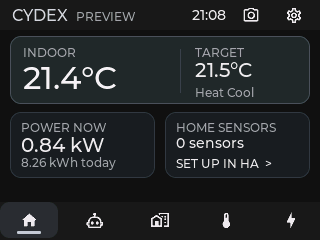
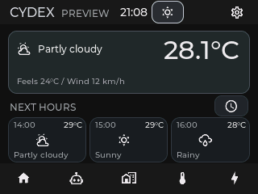
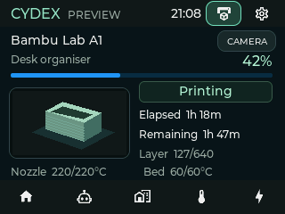

# Project Cydex

Home Assistant dashboards and alerts for a Cheap Yellow Display (CYD) running
ESPHome. Choose what appears on the display from Home Assistant.

*Offline preview with sample data.*

## Features

- Power, energy and up to five named sensor readings.
- Room controls for thermostats, lights and switches.
- Claude usage and up to three other AI providers, using your existing sensors.
- Weather conditions and forecasts.
- Camera snapshots and an optional 3D printer monitor.
- Notice, Warning and Critical alerts, with acknowledge and snooze controls.
- Page visibility, order and automatic rotation.

## Requirements

- Home Assistant 2026.10.0 or newer.
- [HACS](https://www.hacs.xyz/docs/use/).
- A CYD with compatible ESPHome firmware, added to Home Assistant.

Firmware is installed separately; this repository contains the Home Assistant
integration. Camera, weather and printer features need matching firmware support.
Camera and printer images also need a local Home Assistant URL the display can
reach.

## Install

1. Open Project Cydex in HACS using the button below.
2. Download it and restart Home Assistant.
3. Add **Project Cydex** under **Settings > Devices & services** and select your
   ESPHome display.

The button opens the custom repository directly in HACS. To add it manually, use
`ijtan/project-cyder` and choose **Integration**.

## Configure

Open **Configure** on the Project Cydex integration.

- **Dashboard and usage:** choose sensors, room controls, AI usage and a camera.
  Set which pages appear, their order and the rotation interval. Room controls
  follow Home Assistant Areas, with up to four Areas and five devices per Area.
- **Weather and forecast:** select a weather entity. Its provider supplies the
  location and units. Matching firmware lets you switch between hourly and daily
  forecasts when both are available.
- **3D printer monitor:** choose a Bambu Lab printer from its Home Assistant
  integration, or map entities yourself. Choose when the monitor appears and
  which images it uses. It shows readings; it does not control the printer.
- **Alert rules:** select a numeric sensor, limit and priority. Add a warning
  threshold or choose a page to open when the alert appears.

Clear an optional source with **×**, then select **Submit**. Unassigned readings
and controls are cleared or hidden.

## Alerts

The highest-priority active alert appears first. **Ack until clear** hides it
until the reading recovers; **Snooze 15 min** hides it temporarily. A higher-priority
alert can still appear.

Limits use the sensor's own units. Hysteresis sets how far the reading must
recover before an alert clears. Unavailable readings do not clear active alerts.

## Camera and printer images

Images are small colour snapshots, refreshed every 10–120 seconds while the
page is open. They are not live video and may be up to a minute old.

The printer monitor uses the camera shortcut while visible. Switch between the
print image and chamber view, or tap the image to enlarge it. Your normal camera
selection is kept and returns when the printer monitor is hidden.

Cydex uses Home Assistant's local URL automatically. If you set an **Internal
URL** yourself, make sure the CYD can reach it. Slow or offline image sources may
fail to load.

## Screenshots

Offline previews from the firmware's LVGL renderer, using sample data.

**Weather**

**3D printer monitor**

## Updates

Keep the integration and firmware compatible. When a firmware update is required:

1. Disable Project Cydex in Home Assistant.
2. Install the matching firmware and confirm the display reconnects.
3. Update Project Cydex in HACS and restart Home Assistant.
4. Enable Project Cydex again.

Older firmware using the single `update_dashboard` action is unsupported; current
firmware needs the eight separate dashboard actions and matching alert actions.
Bluetooth and iPhone notifications are not included in this integration.

## Help and licence

[Report a bug](https://github.com/ijtan/project-cyder/issues).
Licensed under [GPL-3.0-only](LICENSE).
